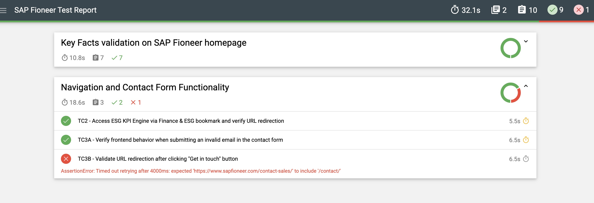

# Automated Tests for SAP Fioneer Website

This project contains automated tests developed to fulfill the requirements of the QA Automation Challenge provided by the SAP Fioneer ESG Team.

---

## Test Cases Overview

- **Test 1**  
  Navigate to the SAP Fioneer homepage (SAP Fioneer | World-class software solutions for financial services) and verify the Key Facts section is present and accurate

- **Test 2**  
  From the homepage, under the Finance & ESG menu, click on ESG KPI Engine.
  Verify redirection to the correct page:
  Stay audit-ready with the ESG KPI Engine | SAP Fioneer, which contains relevant project information.

- **Test 3**  
  From the same main page, click on the **Get in touch** button.  
  Confirm that the user is redirected to the correct page:  
  _SAP Fioneer | Contact | Get in touch!_  
  In the contact form, enter an invalid email (e.g., `342323`) in the **Work email** field and verify that the correct validation message is displayed.

---

**About BDD (Behavior Driven Development)**
This project uses BDD (Behavior Driven Development) to write tests in simple Gherkin language, so both technical folks and non-technical team members can easily understand them. It helps everyone work together and makes sure the tests really cover what the business needs.

**Test Reporting**
We use Mochawesome to create detailed test reports in JSON and HTML formats. These reports show all the test results, include screenshots when something fails, and have charts to help you quickly understand what’s going on. They’re made after running tests in headless mode and you can open the HTML report right in any browser.

---

## Framework & Technologies

This test suite was developed using the following tools and methodologies:

- **Cypress** – for end-to-end test automation  
- **TypeScript** – language used to implement the tests  
- **BDD (Behavior Driven Development)** – to structure tests in a way that is understandable for both technical and non-technical stakeholders  
- **Page Object Pattern** – to separate page structure from test logic, improving code reuse and readability

---

## Project Structure and Files

- **`features`**  
  Contains BDD feature files written in Gherkin syntax, describing test scenarios in a readable and collaborative way.

- **`step_definitions`**  
  Maps each step of the feature files to Cypress commands and functions.

- **`actions`**  
  Contains the logics and code implemented.

- **`locators`**  
  Centralizes element selectors to ensure maintainability and reuse across tests.

- **`fixtures`**  
  Holds static data and mock responses used during test execution.

---

## Running the Tests

 - **Prerequisites**
   Make sure you have [Node.js](https://nodejs.org/) installed (version 14 or higher recommended).
   This project uses Cypress for end-to-end testing, which will be installed automatically as a dev dependency.

  - **Base URL**  
    The tests are configured to run against the base URL:  `https://www.sapfioneer.com/`  
    This is set in the Cypress config, so all test URLs are relative to this address.

 - **Install dependencies**  
    npm install

 - **Run via browser mode -> * Opens Cypress Test Runner UI where you can select the browser and run the desired tests interactively**  
    npx cypress open

 - **Run via headless mode -> Runs tests in the terminal without opening a browser; results and logs are shown in the console**  
     npx cypress run

 - **Run tests by tag -> To run specific test filtered by tag. The tags were added to each feature file in this project**  
    npx cypress run --env TAGS='@desiredTag'

 - **Run tests in headless mode, generate JSON report with screenshots, then generate an HTML report from the JSON file for easy viewing in the browser** 
    npx cypress run:report
    npm run report:html

 - **Note: All reports,jsons & screenshots will be ignored in the commits**  
